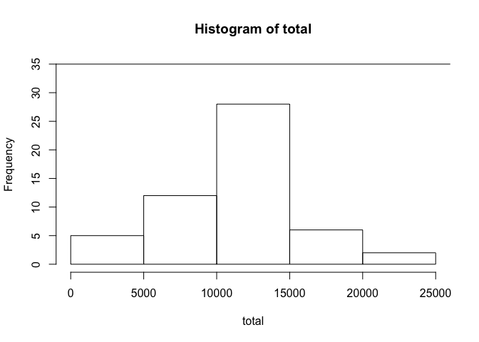
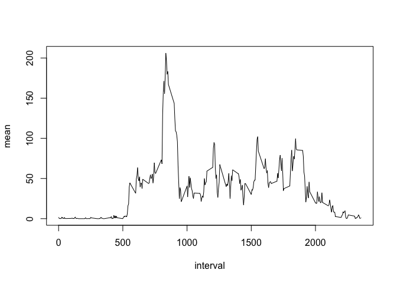
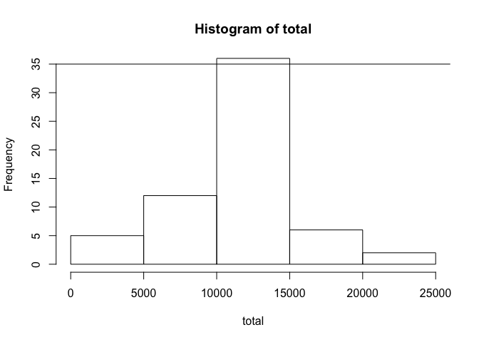
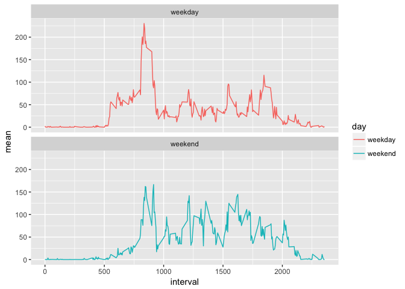

## Loading and preprocessing the data


```r
library(ggplot2)
library(dplyr)
```

```
## 
## Attaching package: 'dplyr'
```

```
## The following objects are masked from 'package:stats':
## 
##     filter, lag
```

```
## The following objects are masked from 'package:base':
## 
##     intersect, setdiff, setequal, union
```

```r
# 1. Load the data (i.e.read.csv())  
fileUrl <- "https://d396qusza40orc.cloudfront.net/repdata%2Fdata%2Factivity.zip"
download.file(fileUrl, destfile="./dataActivity.zip", method="curl")
unzip("./dataActivity.zip")
actData0 <- read.csv("activity.csv", na.strings = "NA")
```


```r
# 2. Process/transform the data (if necessary) into a format suitable for your analysis
actData0 <- tbl_df(actData0)
```

## What is mean total number of steps taken per day?


```r
# 1. Calculate the total number of steps taken per day
dateGrp0 <- group_by(actData0, date)
dateGrp0$steps <- as.numeric(as.character(dateGrp0$steps))
stepTotal0 <- summarize(dateGrp0, 
                       total=sum(steps))
```


```r
# 2. Make a histogram of the total number of steps taken each day
with(stepTotal0, hist(total, ylim=c(0,35)))
abline(h=35)
```

<!-- -->


```r
# 3. Calculate and report the mean and median of the total number of steps taken per day 
mean0 <- as.character(round(mean(stepTotal0$total, na.rm=TRUE),2))
median0 <- as.character(median(stepTotal0$total, na.rm=TRUE))
```

**Calculate and report the mean and median of the total number of steps taken per day**

- The **mean** of the total number of steps taken per day is **10766.19**, and the **median** of the total number of steps per day is **10765**. 

## What is the average daily activity pattern?


```r
# 1. Make a time series plot (i.e.type=“l”) of the 5-minute interval (x-axis) and the average number of steps taken, averaged across all days (y-axis)
intGrp0 <- group_by(actData0, interval)
intGrp0$steps <- as.numeric(as.character(intGrp0$steps))
avgSteps <- summarize(intGrp0, 
                      mean=mean(steps, na.rm=TRUE))
with(avgSteps,plot(x=interval, y=mean, type="l"))
```

<!-- -->


```r
# 2. Which 5-minute interval, on average across all the days in the dataset, contains the maximum number of steps?
maxDat <- filter(avgSteps, mean==max(mean))
maxInt <- maxDat$interval[1]
maxSteps <- maxDat$mean[1]
```

**Which 5-minute interval, on average across all the days in the dataset, contains the maximum number of steps?**

- The **interval 835** contains the maximum number of steps, which is 206.1698113. 

## Imputing missing values


```r
# 1. Calculate and report the total number of missing values in the dataset
naDat <- dateGrp0[is.na(dateGrp0$steps),1]
naTotal <- nrow(naDat)
```


```r
# 2. Devise a strategy for filling in all of the missing values in the dataset. 
stepMean <- avgSteps$mean
stepMean <- rep(stepMean, 8)
## makes a vector of the average steps for each interval, then repeats 8 times for the 8 days with missing values. 
```


```r
# 3. Create a new dataset that is equal to the original dataset but with the missing data filled in.
dateGrp1 <- group_by(actData0, date)
dateGrp1[is.na(dateGrp1$steps),1] <- mutate(
    dateGrp1[is.na(dateGrp1$steps),1], steps=stepMean)
## the NA values of the dataset are subsetted, then mutate replaces them with stepMean, under a new object, dateGrp1.
```


```r
# 4. Make a histogram of the total number of steps taken each day.
stepTotal1 <- summarize(dateGrp1, 
                       total=sum(steps))
with(stepTotal1, hist(total, ylim=c(0,35)))
abline(h=35)
```

<!-- -->


```r
# 4.1. Calculate and report the mean and median of the total number of steps taken per day. 
mean1 <- as.character(round(mean(stepTotal1$total, na.rm=TRUE),2))
median1 <- as.character(round(median(stepTotal1$total, na.rm=TRUE),2))
```
  
**Calculate and report the total number of missing values in the dataset.**    
- The **total number of missing values** in the dataset is 2304.

**Calculate and report the mean and median of the total number of steps taken per day.**  
- The **mean** of the total number of steps taken per day is 10766.19, and the **median** of the total number of steps per day is 10766.19. 

**Do these values differ from the estimates from the first part of the assignment?**   
- Yes, while the mean stayed the same, the median changed. The **ignored missing values** has a mean of 10766.19, and a median of 10765, while the **imputed missing values** has a mean of 10766.19, and a median of 10766.19. 

**What is the impact of imputing missing data on the estimates of the total daily number of steps?**   
- Imputing the missing data affected the total daily number of steps by increasing the frequency of occurences between 10,000 and 15,000 as shown by the histogram's middle bin. There wasn't a big difference in mean or median after imputing the missing data. 

## Are there differences in activity patterns between weekdays and weekends?


```r
# 1. Create a new factor variable with two levels indicating whether a given date is a weekday or weekend day.
dateGrp1$date <- as.Date(dateGrp1$date, "%Y-%m-%d")
```

```
## Warning in strptime(x, format, tz = "GMT"): unknown timezone 'default/
## America/New_York'
```

```r
sunVar <- weekdays(dateGrp1$date)=="Sunday"
satVar <- weekdays(dateGrp1$date)=="Saturday"
endInx <- which(sunVar|satVar)
dayInx <- which(!sunVar&!satVar)
weekVar <- factor(levels=c("weekday", "weekend"))
weekVar[endInx]="weekend"
weekVar[dayInx]="weekday"
actData1 <- ungroup(dateGrp1)
intGrp1 <- mutate(actData1, day=weekVar)
intGrp1 <- group_by(intGrp1, interval, day)
weekSum <- summarize(intGrp1, mean=mean(steps))
```


```r
# 2. Make a panel plot containing a time series plot of the 5-minute interval (x-axis) and the average number of steps taken, averaged across all weekday days or weekend days (y-axis).
g <- ggplot(weekSum, aes(interval, mean))
g+geom_line(aes(col=day))+facet_wrap(~day, nrow=2)
```

<!-- -->
